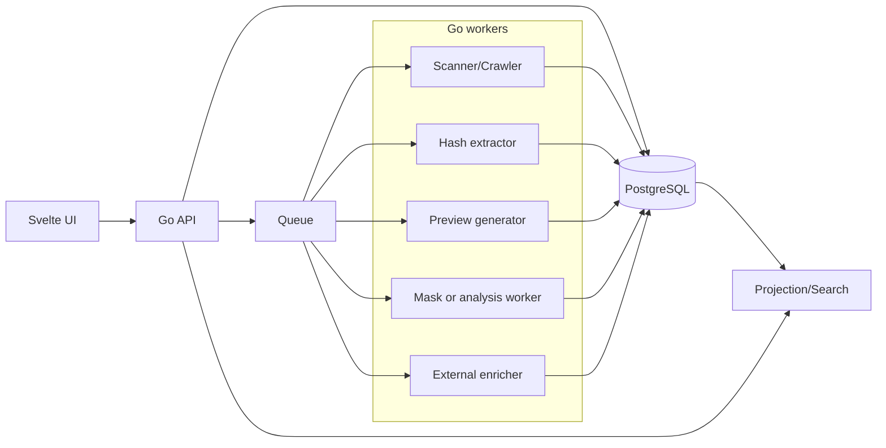

# Техническая документация: metadata platform

Проект — это metadata / enrichment платформа для файлов и связанных сущностей, построенная вокруг четырёх базовых объектов: `entity`, `relation`, `job`, `projection`.[cite:201][cite:199]

Стек:

- фронтенд: **Svelte**;
- backend API и воркеры: **Go**;
- БД: **PostgreSQL** с `jsonb`, GIN и full-text search по `tsvector`.[cite:201][cite:216][cite:219]

## Назначение

Система должна:

- хранить сущности: файлы, внешние объекты, локации, previews, маски, коллекции и другие доменные объекты;
- хранить связи между ними;
- позволять хранить как структурные связи, так и групповые «факты» в виде JSON payload в relation;
- принимать данные от crawler'ов, extractors, enrichers и derivation workers;
- поддерживать поиск по структурированным и текстовым полям.[cite:199][cite:202][cite:220]

## Концептуальная модель

Главная идея — не делить жёстко мир на «атрибуты» и «связи». В системе есть сущности и отношения между ними, а отношения могут нести полезную нагрузку в `value jsonb`.[cite:178][cite:188]

### Entity

Любой объект в системе.

```ts
interface Entity {
  id: string;
  type: string;
  subType?: string;
  name?: string;
  description?: string;
  meta?: Record<string, unknown>;
  updatedAt: string;
}
```

Примеры:

- файл;
- папка;
- внешний объект из Stash;
- preview image;
- segmentation mask;
- tag;
- коллекция.

### Relation

Связь между двумя сущностями. Может быть как «чистой связью», так и контейнером для набора связанных фактов.[cite:178][cite:182]

```ts
interface Relation {
  id: string;
  from: string;
  to: string;
  type: string;
  subType?: string;
  value?: unknown;
  meta?: Record<string, unknown>;
  updatedAt: string;
}
```

Примеры:

- `type=linksTo`, `subType=stashScene`;
- `type=storedIn`, `subType=filesystem`;
- `type=derivedFrom`, `subType=preview`;
- `type=fact`, `subType=stash:info`, `value={ views, rating, lastViewedAt }`.

### Job

Любой процесс обработки или обогащения.

```ts
interface Job {
  id: string;
  entityId?: string;
  relationId?: string;
  kind: string;
  worker: string;
  status: string;
  payload?: Record<string, unknown>;
  updatedAt: string;
}
```

### Projection

Денормализованное представление сущности для UI и быстрых API-ответов.[cite:199][cite:202]

```ts
interface Projection {
  entityId: string;
  value: Record<string, unknown>;
  updatedAt: string;
}
```

## Почему такая модель

PostgreSQL умеет эффективно работать с `jsonb`, включая GIN-индексы для containment и JSON path запросов, а также полнотекстовый поиск через `tsvector` и GIN по нему.[cite:201][cite:216][cite:203]

Это позволяет хранить grouped payload в `relation.value`, не разбивая каждое поле на отдельную таблицу или отдельную строку, но при этом сохранять возможность поиска и индексации.[cite:199][cite:217]

## Архитектура системы



## Роли компонентов

### Svelte frontend

Фронтенд отвечает за:

- поиск сущностей;
- просмотр карточки сущности;
- просмотр графа связей;
- просмотр relations с JSON payload;
- ручной запуск jobs;
- просмотр derived artifacts и внешних enrichment payloads.[cite:220][cite:222]

Рекомендуемая структура фронта:

- `routes/` — страницы;
- `lib/api/` — typed API client;
- `lib/stores/` — состояние фильтров и текущего контекста;
- `lib/components/graph/` — визуализация связей;
- `lib/components/json/` — просмотрщик `value` и `meta`.

### Go backend

Backend на Go делится на два слоя:

- HTTP API;
- background workers / crawlers / enrichers.[cite:223][cite:219]

#### API responsibilities

- CRUD для `entities`;
- CRUD для `relations`;
- запуск jobs;
- чтение projections;
- поиск по JSONB и full-text;
- выдача графа соседей для сущности.

#### Workers responsibilities

- искать новые файлы;
- строить hashes;
- строить previews;
- строить masks, embeddings и derived artifacts;
- подтягивать внешние данные из Stash и других систем;
- писать relations и обновлять projections.

## Потоки данных

### Discovery

1. Scanner обходит файловые источники.
2. Для каждого найденного объекта создаётся `entity(type=file)`.
3. Создаются relations вроде `storedIn` или `discoveredAt`.
4. В очередь ставятся jobs на hash, preview и enrichment.

### Derivation

1. Worker получает job.
2. Читает исходный файл.
3. Генерирует артефакт или мету.
4. При необходимости создаёт новую entity, например `entity(type=artifact, subType=preview)`.
5. Создаёт relation `derivedFrom` и relation `fact` с JSON payload.

### External enrichment

1. Enricher получает entity или relation с нужными идентификаторами.
2. Идёт во внешний сервис.
3. Создаёт relation вида `fact/stash:info` или `linksTo/stashScene`.
4. Триггерит rebuild projection.

## Схема БД

### Таблица `entities`

```sql
create table entities (
  id uuid primary key,
  type text not null,
  subtype text,
  name text,
  description text,
  meta jsonb not null default '{}'::jsonb,
  updated_at timestamptz not null default now()
);

create index entities_type_idx on entities (type, subtype);
create index entities_meta_gin_idx on entities using gin (meta);
```

### Таблица `relations`

```sql
create table relations (
  id uuid primary key,
  from_id uuid not null references entities(id) on delete cascade,
  to_id uuid not null references entities(id) on delete cascade,
  type text not null,
  subtype text,
  value jsonb not null default '{}'::jsonb,
  meta jsonb not null default '{}'::jsonb,
  updated_at timestamptz not null default now(),
  search_tsv tsvector
);

create index relations_from_idx on relations (from_id);
create index relations_to_idx on relations (to_id);
create index relations_type_idx on relations (type, subtype);
create index relations_value_gin_idx on relations using gin (value);
create index relations_meta_gin_idx on relations using gin (meta);
create index relations_search_tsv_gin_idx on relations using gin (search_tsv);
```

`GIN` подходит для composite-значений вроде `jsonb`, а `tsvector` + `GIN` — стандартный путь для full-text search в PostgreSQL.[cite:216][cite:203][cite:208]

### Таблица `jobs`

```sql
create table jobs (
  id uuid primary key,
  entity_id uuid references entities(id) on delete cascade,
  relation_id uuid references relations(id) on delete cascade,
  kind text not null,
  worker text not null,
  status text not null,
  payload jsonb not null default '{}'::jsonb,
  updated_at timestamptz not null default now()
);
```

### Таблица `projections`

```sql
create table projections (
  entity_id uuid primary key references entities(id) on delete cascade,
  value jsonb not null default '{}'::jsonb,
  updated_at timestamptz not null default now(),
  search_tsv tsvector
);
```

## Full-text поиск

Структурный поиск и текстовый поиск — не одно и то же.[cite:199][cite:202]

- Для точного поиска по JSON используется `jsonb` + GIN.[cite:201][cite:216]
- Для поиска по словам и фразам внутри многих полей нужен `tsvector`, обычно собираемый триггером или кодом приложения.[cite:202][cite:203]

Рекомендуемый подход:

- в `relations.search_tsv` включать текст из `type`, `subtype`, `value` и `meta`;
- в `projections.search_tsv` включать агрегированное представление карточки сущности.[cite:202][cite:203]

## Примеры relation-модели

### Hash

```json
{
  "type": "fact",
  "subType": "hash:sha256",
  "value": {
    "hash": "..."
  }
}
```

### Stash info

```json
{
  "type": "fact",
  "subType": "stash:info",
  "value": {
    "sceneId": "987",
    "views": 42,
    "rating": 4.7,
    "lastViewedAt": "2026-04-07T17:55:00Z"
  },
  "meta": {
    "source": "stash@home"
  }
}
```

### Derived preview

```json
{
  "type": "derivedFrom",
  "subType": "preview",
  "value": {
    "generator": "preview-worker:v1",
    "format": "jpeg",
    "width": 320,
    "height": 180
  }
}
```

## Go implementation notes

Для работы с `jsonb` в Go удобно либо использовать `map[string]any`, либо typed structs, если схема конкретного payload стабильна. PostgreSQL `jsonb` можно маппить через `driver.Valuer` и `sql.Scanner`, чтобы сериализовать и десериализовать структуры прозрачно.[cite:219][cite:226]

Рекомендуемый набор модулей backend:

- `internal/http` — REST handlers;
- `internal/store` — SQL access layer;
- `internal/domain` — entity/relation/job модели;
- `internal/search` — FTS/JSON query builders;
- `internal/workers` — crawler, hash, preview, analysis, enrichers;
- `internal/projection` — пересборка projections.

## Svelte implementation notes

Фронтенду нужен тонкий API client и ясное разделение экранов поиска, карточки сущности и графового просмотра. Отдельный typed client и централизованные query patterns упрощают работу с API и кэшированием.[cite:220][cite:222]

Рекомендуемые экраны:

- search;
- entity details;
- relations browser;
- jobs monitor;
- raw JSON inspector.

## Рекомендации по старту

### MVP

Сначала реализовать:

- `entities`;
- `relations`;
- `jobs`;
- `projections`;
- scanner worker;
- hash worker;
- stash enricher;
- поиск по `type/subtype`, JSONB и full-text.[cite:199][cite:216][cite:202]

### Потом

Добавлять:

- preview generator;
- image masks / OCR / embeddings;
- relation graph view;
- partial indexes под горячие кейсы поиска, если общего GIN уже мало.[cite:199][cite:225]

## Главный компромисс модели

Модель `entity + relation + json payload` очень гибкая, но search-path и read-model придётся проектировать отдельно. PostgreSQL это хорошо поддерживает, но для предсказуемой производительности обычно нужен combo из `btree`, `GIN(jsonb)` и `GIN(tsvector)` индексов.[cite:199][cite:216][cite:208]
